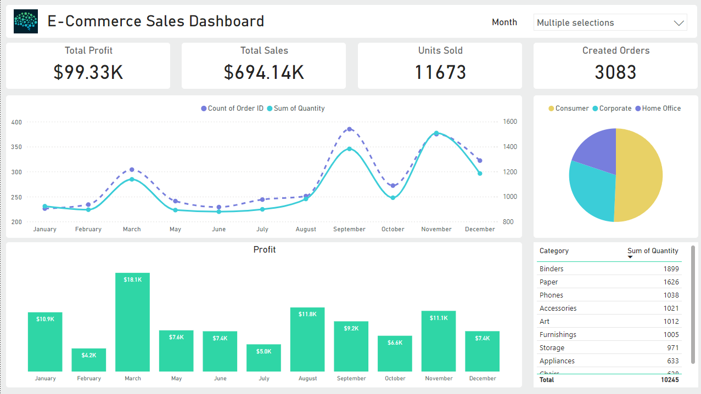

# eCommerce Sales Dashboard with PowerBI 📊

## Description

This project showcases an interactive PowerBI dashboard that provides comprehensive insights into eCommerce sales performance. The dashboard focuses on key performance indicators (KPIs) and visualizations to help businesses track and optimize their sales strategies.

## Key Highlights:

- **KPI Tracking:**  
  Displays crucial metrics such as **Profit**, **Sales**, **Units Sold**, and more to measure business performance effectively.

- **Time-Series Analysis:**  
  Includes visualizations to analyze sales and profit trends over time, enabling users to identify seasonality and growth patterns.

- **Interactive Visualizations:**  
  Provides dynamic charts and filters, allowing users to explore data by categories such as product, region, and customer segments.

- **Actionable Insights:**  
  Helps decision-makers uncover opportunities and optimize strategies through data-driven analysis.

This project demonstrates the capabilities of PowerBI in creating intuitive, data-rich dashboards for eCommerce businesses, empowering stakeholders to make informed decisions.
